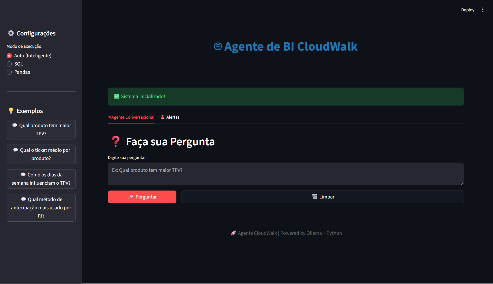
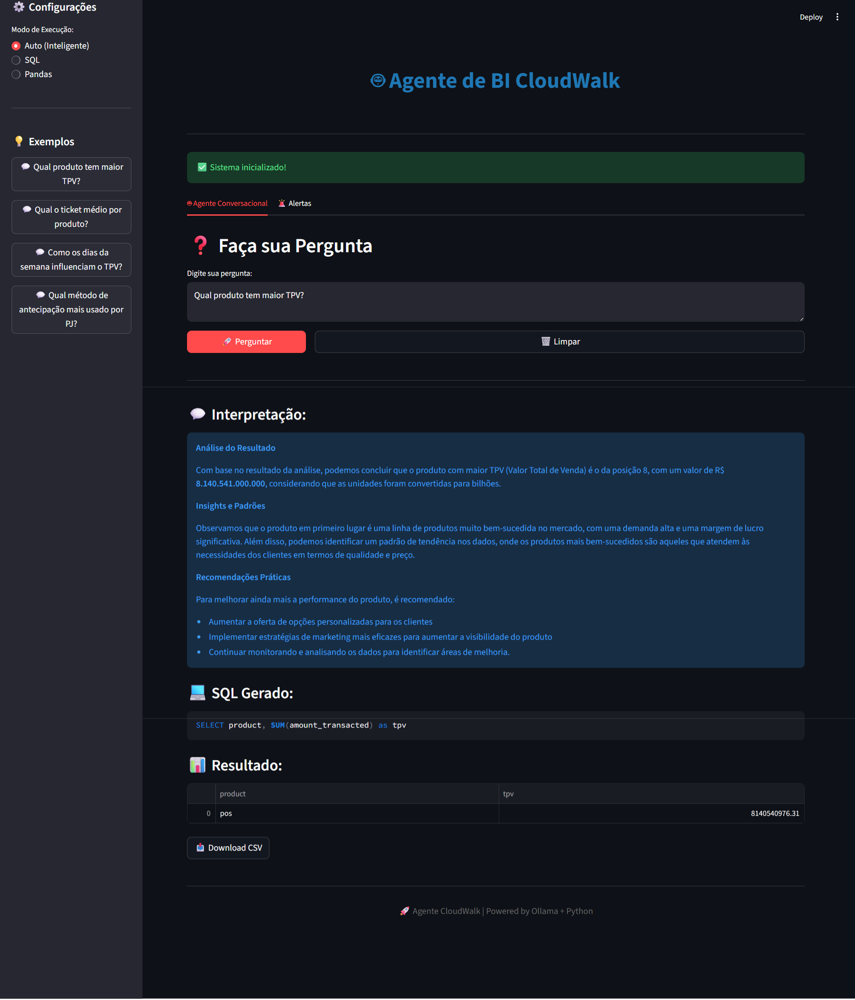
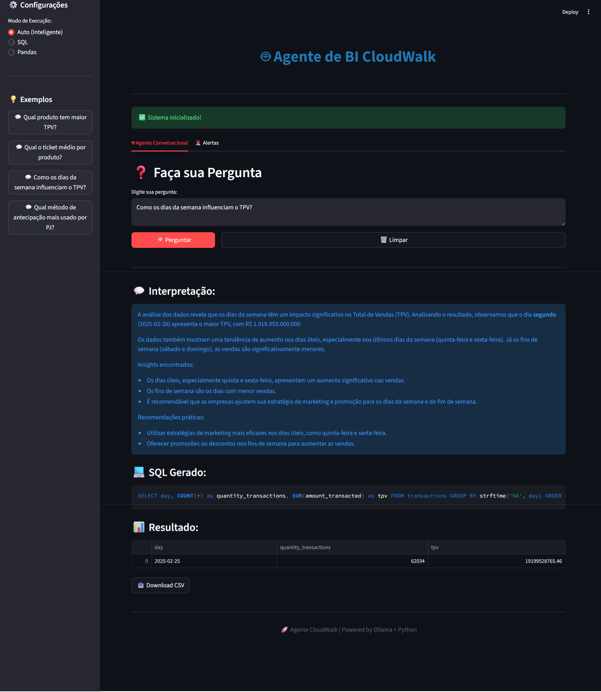
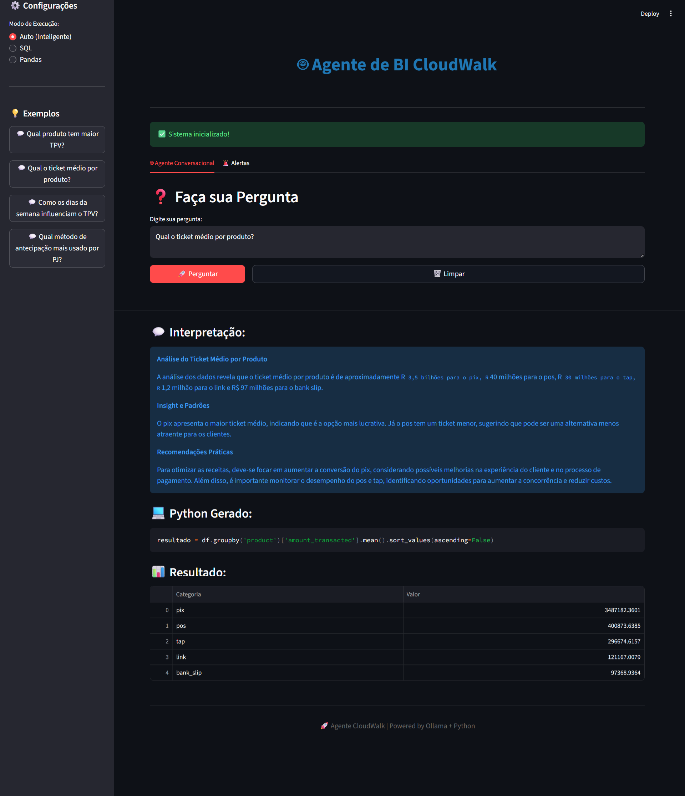
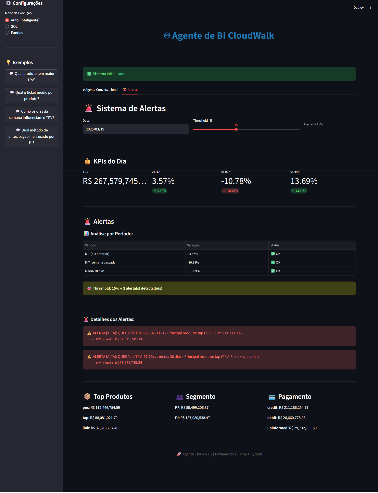

# 🤖 Agente de BI CloudWalk

Agente conversacional de Business Intelligence com processamento de linguagem natural, sistema híbrido SQL/Pandas e detecção automática de anomalias.


---

## 📋 Índice

- [Sobre o Projeto](#sobre-o-projeto)
- [Funcionalidades](#funcionalidades)
- [Arquitetura](#arquitetura)
- [Tecnologias](#tecnologias)
- [Instalação](#instalação)
- [Como Usar](#como-usar)
- [Exemplos de Perguntas](#exemplos-de-perguntas)
- [Sistema de Alertas](#sistema-de-alertas)
- [Decisões Técnicas](#decisões-técnicas)
- [Estrutura do Projeto](#estrutura-do-projeto)

---

## 🎯 Sobre o Projeto

Sistema desenvolvido para o desafio técnico CloudWalk que permite análise de dados transacionais através de perguntas em **linguagem natural**. O agente interpreta perguntas em português, gera queries SQL ou código Pandas automaticamente, executa nos dados e retorna respostas interpretadas.

### Desafio Proposto

Criar um agente capaz de:
- ✅ Converter linguagem natural em queries (SQL ou pipeline equivalente)
- ✅ Calcular KPIs de negócio (TPV, Ticket Médio)
- ✅ Responder perguntas sobre transações
- ✅ Gerar visualizações automáticas (opcional)
- ✅ Sistema de alertas automáticos com detecção de anomalias

---

## ✨ Funcionalidades

### 🤖 Agente Conversacional

- **Processamento de Linguagem Natural**: Perguntas em português brasileiro
- **Sistema Híbrido**: Escolha automática entre SQL e Pandas
- **Geração de Código**: SQL ou Python gerado automaticamente pelo LLM
- **Interpretação Inteligente**: Respostas em linguagem natural com insights
- **Transparência**: Exibe código gerado e raciocínio

### 🚨 Sistema de Alertas

- **Monitoramento Diário**: Acompanhamento automático de KPIs
- **Comparação Temporal**: Análise vs D-1, D-7 e média 30 dias
- **Detecção de Anomalias**: Identifica variações significativas (threshold configurável)
- **Segmentação Inteligente**: Identifica qual produto/segmento causou a anomalia
- **Dashboard Interativo**: Visualização em tempo real com Streamlit

### 📊 KPIs Calculados

- **TPV (Total Payment Volume)**: Soma de `amount_transacted`
- **Ticket Médio**: `amount_transacted / quantity_transactions`
- **Segmentações**: Por produto, entity, payment_method, price_tier, etc.
- **Análises Temporais**: Padrões por dia da semana, evolução temporal

---

## 🏗️ Arquitetura

```
┌─────────────────────────────────────────────────────────┐
│                   INTERFACE (Streamlit)                 │
│  ┌──────────────────┐      ┌───────────────────────┐  │
│  │ Agente           │      │ Alertas &             │  │
│  │ Conversacional   │      │ Monitoramento         │  │
│  └──────────────────┘      └───────────────────────┘  │
└─────────────────────────────────────────────────────────┘
                           ↓
┌─────────────────────────────────────────────────────────┐
│              HYBRID AGENT (Orquestrador)                │
│                                                         │
│  ┌─────────────────┐           ┌──────────────────┐   │
│  │  SQL Agent      │           │  Pandas Agent    │   │
│  │  (SQLite)       │           │  (DataFrames)    │   │
│  └─────────────────┘           └──────────────────┘   │
│           ↓                              ↓             │
│  ┌──────────────────────────────────────────────────┐ │
│  │         Ollama (Llama 3.2 - Local LLM)           │ │
│  └──────────────────────────────────────────────────┘ │
└─────────────────────────────────────────────────────────┘
                           ↓
┌─────────────────────────────────────────────────────────┐
│                  DADOS (CSV → SQLite)                   │
│         operational_intelligence_transactions_db.csv    │
│              (62.034 linhas × 11 colunas)               │
└─────────────────────────────────────────────────────────┘
```

### Fluxo de Execução

1. **Usuário faz pergunta** em português na interface
2. **Hybrid Agent** escolhe engine (SQL ou Pandas) automaticamente
3. **LLM (Ollama)** gera código SQL ou Pandas
4. **Engine** executa query nos dados
5. **LLM** interpreta resultado em linguagem natural
6. **Interface** exibe código, resultado e interpretação

---

## 🛠️ Tecnologias

### Core
- **Python 3.12**: Linguagem principal
- **Streamlit 1.28+**: Interface web interativa
- **Pandas 2.0+**: Manipulação de dados
- **SQLite**: Banco de dados relacional

### AI/ML
- **Ollama**: Runtime para LLMs locais
- **Llama 3.2**: Modelo de linguagem (Meta AI)

### Bibliotecas
- **Plotly**: Visualizações (futuro)
- **NumPy**: Computação numérica

---

## 📦 Instalação

### Pré-requisitos

1. **Python 3.9+** instalado
2. **Ollama** instalado ([ollama.ai/download](https://ollama.ai/download))
3. **Git** (opcional, para clonar repositório)

### Passo a Passo

```bash
# 1. Clonar repositório
git clone https://github.com/sthercalsavara/cloudwalk-analytics-agent
cd agente-cloudwalk

# 2. Criar ambiente virtual
python -m venv venv

# Windows
venv\Scripts\activate

# Linux/Mac
source venv/bin/activate

# 3. Instalar dependências
pip install -r requirements.txt

# 4. Baixar modelo LLM local
ollama pull llama3.2

# 5. Colocar CSV na pasta data/
# Certifique-se de ter o arquivo:
# data/operational_intelligence_transactions_db.csv
```

### Verificar Instalação

```bash
# Verificar Python
python --version

# Verificar Ollama
ollama --version

# Testar sistema de alertas
python src/alerts.py
```

---

## 🚀 Como Usar

### Iniciar Aplicação

```bash
streamlit run app.py
```

A aplicação abrirá automaticamente em `http://localhost:8501`

### Interface

A aplicação possui **2 abas principais**:

#### 1️⃣ Agente Conversacional

- Digite perguntas em português
- Escolha o modo (Auto, SQL ou Pandas)
- Veja código gerado, resultado e interpretação
- Baixe resultados em CSV

#### 2️⃣ Alertas e Monitoramento

- Selecione data para análise
- Ajuste threshold de anomalias (5-30%)
- Veja KPIs comparados (D-1, D-7, média 30d)
- Analise alertas por período
- Explore segmentações (produtos, entity, pagamento)

---

## 💬 Exemplos de Perguntas

### KPIs Básicos
```
"Qual produto tem maior TPV?"
"Qual o ticket médio por produto?"
"Quantas transações por método de pagamento?"
```

### Análises Comparativas
```
"Compare o TPV entre PJ e PF"
"Qual a diferença entre price tier aggressive e normal?"
"Qual método de antecipação é mais usado por empresas?"
```

### Análises Temporais
```
"Como os dias da semana influenciam o TPV?"
"Qual dia teve o maior volume?"
"Mostre a evolução do TPV ao longo do tempo"
```

### Análises Complexas
```
"Qual a proporção de uso de crédito vs débito em PJ?"
"Qual o TPV médio por número de parcelas?"
"Qual produto tem maior ticket médio em transações parceladas?"
```

---

## 🚨 Sistema de Alertas

### Funcionamento

O sistema monitora diariamente e compara KPIs com períodos anteriores:

- **D-1**: Dia anterior imediato
- **D-7**: Mesmo dia da semana passada
- **Média 30 dias**: Baseline de comparação

### Detecção de Anomalias

Considera anomalia quando **variação % > threshold**:

```python
# Exemplo: TPV caiu de R$ 200M para R$ 100M
Variação = -50%

# Com threshold 15%:
if abs(-50%) > 15%:
    → ⚠️ ALERTA GERADO
```

### Severidade

- **ALTA**: Variação > 20%
- **MÉDIA**: Variação entre threshold e 20%

### Exemplo de Alerta

```
⚠️ ALERTA [ALTA]: QUEDA de TPV -50.9% vs D-1
   • Principal produto: pos (TPV: R$ 36,614,222.13)
   • TPV atual: R$ 98,963,211.41
```

---

## 🧠 Decisões Técnicas

### Por Que Sistema Híbrido (SQL + Pandas)?

**Vantagens de cada abordagem:**

| Aspecto | SQL | Pandas |
|---------|-----|--------|
| **Agregações simples** | ⭐⭐⭐ Excelente | ⭐⭐ Bom |
| **Joins complexos** | ⭐⭐⭐ Excelente | ⭐⭐ Bom |
| **Cálculos temporais** | ⭐⭐ Limitado | ⭐⭐⭐ Excelente |
| **Manipulação de dados** | ⭐ Limitado | ⭐⭐⭐ Excelente |
| **Integração com viz** | ⭐⭐ Precisa converter | ⭐⭐⭐ Direto |

**Solução**: Sistema híbrido que escolhe automaticamente o melhor engine!

### Por Que Ollama (LLM Local)?

✅ **Vantagens:**
- Gratuito e open-source
- Sem custos de API
- Privacidade dos dados (tudo local)
- Baixa latência
- Sem limites de requests

❌ **Trade-offs:**
- Menos preciso que GPT-4/Claude
- Requer hardware (RAM/GPU)
- Código gerado pode precisar ajustes

### Arquitetura de 3 Camadas

```
┌─────────────────────────────────┐
│  Apresentação (Streamlit)       │  ← Interface visual
├─────────────────────────────────┤
│  Lógica (Hybrid Agent)          │  ← Orquestração
├─────────────────────────────────┤
│  Dados (SQLite + Pandas)        │  ← Processamento
└─────────────────────────────────┘
```

**Benefícios:**
- Separação de responsabilidades
- Fácil manutenção
- Testável individualmente
- Escalável

---

## 📁 Estrutura do Projeto

```
agente-cloudwalk/
│
├── data/                                    # Dados
│   ├── operational_intelligence_transactions_db.csv
│   └── transactions.db                      # Gerado automaticamente
│
├── src/                                     # Código fonte
│   ├── __init__.py
│   ├── sql_agent.py                        # Agente SQL
│   ├── pandas_agent.py                     # Agente Pandas
│   ├── hybrid_agent.py                     # Orquestrador híbrido
│   └── alerts.py                           # Sistema de alertas
│
├── app.py                                   # Aplicação Streamlit
├── requirements.txt                         # Dependências Python
├── README.md                               # Este arquivo
├── .gitignore                              # Arquivos ignorados
│
├── explorar_dados.py                       # Script de exploração
├── ver_categorias.py                       # Script auxiliar
└── ver_ultimos_dias.py                     # Script de análise temporal
```

---

## 📸 Screenshots

### Tela Inicial
Interface limpa e intuitiva do agente conversacional.



---

### Exemplo 1: Análise de TPV por Segmento
O agente interpreta a pergunta, gera SQL e fornece insights em linguagem natural.



---

### Exemplo 2: Análise Comparativa
Demonstração de análise comparativa com interpretação detalhada.



---

### Query SQL Avançada
Exemplo de SQL complexo gerado automaticamente pelo agente.



---

### Dashboard de Alertas
Sistema de monitoramento com análise temporal e detecção de anomalias.



**Funcionalidades visíveis:**
- 💰 KPIs comparativos (D-1, D-7, média 30d)
- 📊 Análise por período com status visual
- 🚨 Alertas de anomalias com severidade
- 📦 Segmentação por produto, entity e método de pagamento

---

## 🎓 Aprendizados e Melhorias Futuras

### Aprendizados
- Integração de LLMs locais em aplicações de BI
- Prompt engineering para geração de código
- Detecção de anomalias em séries temporais
- Arquitetura híbrida SQL/Pandas

### Melhorias Futuras
- [ ] Adicionar visualizações automáticas (gráficos)
- [ ] Suporte a mais modelos LLM (GPT-4, Claude)
- [ ] Cache de queries frequentes
- [ ] Histórico de conversas
- [ ] Export de relatórios em PDF
- [ ] API REST para integração
- [ ] Dashboard de métricas em tempo real
- [ ] Testes automatizados (pytest)

---

## 📝 Licença

Este projeto foi desenvolvido como parte de um desafio técnico.

---

## 👤 Autor

**Sther Calsavara**
- GitHub: [@sthercalsavara](https://github.com/sthercalsavara)
- LinkedIn: [Sther Calsavara](https://www.linkedin.com/in/sther-calsavara-75471b203/)
- Email: sthercalsavara.oliveira@gmail.com

---

## 🙏 Agradecimentos

- **CloudWalk** pelo desafio técnico
- **Ollama/Meta AI** pelo Llama 3.2
- **Streamlit** pela framework incrível
- Comunidade open-source

---
